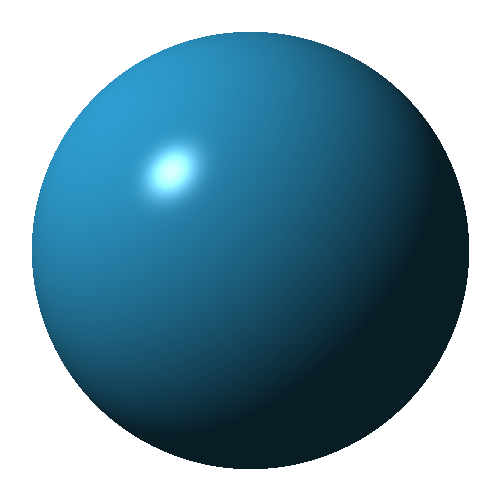

# pytracer

Ray tracing in Python.



## Examples

Examples assume [iTerm](https://iterm2.com/) with [imgcat](https://pypi.org/project/imgcat/) installed.

If imagecat is not installed, pipe output to a .ppm file instead of into imgcat, and open with macos Preview, or another program that supports PPM files (try [IrfanView](https://www.irfanview.com/)).

### Creating a PPM image from a pytracer Canvas


```bash
$ poetry install
$ poetry run python examples/canvas_to_ppm.py | imgcat
```


