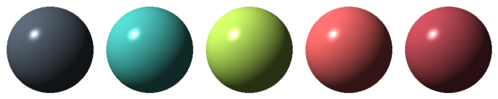

# pytracer

Ray tracing in Python. My implementation of [The Ray Tracer Challenge](https://pragprog.com/titles/jbtracer/the-ray-tracer-challenge/) by [Jamis Buck](https://twitter.com/jamis).



## Examples

Examples assume [iTerm](https://iterm2.com/) with [imgcat](https://pypi.org/project/imgcat/) installed.

If imagecat is not installed, pipe output to a .ppm file instead of into imgcat, and open with macos Preview, or another program that supports PPM files (try [IrfanView](https://www.irfanview.com/)).

Before running examples, be sure to install the project:

```bash
$ poetry install
```

### Render a scene from a YAML file

```bash
pytracer examples/scene_reflection.yaml --width 1600 --height 800 |imgcat
```


### Transparency

```bash
pytracer examples/transparency.yaml --width 1000 --height 500 | imgcat
```


### World and Camera

```bash
$ poetry run python examples/world_and_camera.py | imgcat
```


### Creating a PPM image from a pytracer Canvas

```bash
$ poetry run python examples/canvas_to_ppm.py | imgcat
```


## Acknowledgements

* Ray Tracer Challenge book:<br><a href="https://pragprog.com/titles/jbtracer/the-ray-tracer-challenge/"></a>

* Color palette for sample image:<br><a href="https://www.colourlovers.com/palette/1930/cheer_up_emo_kid" target="_blank"></a>
